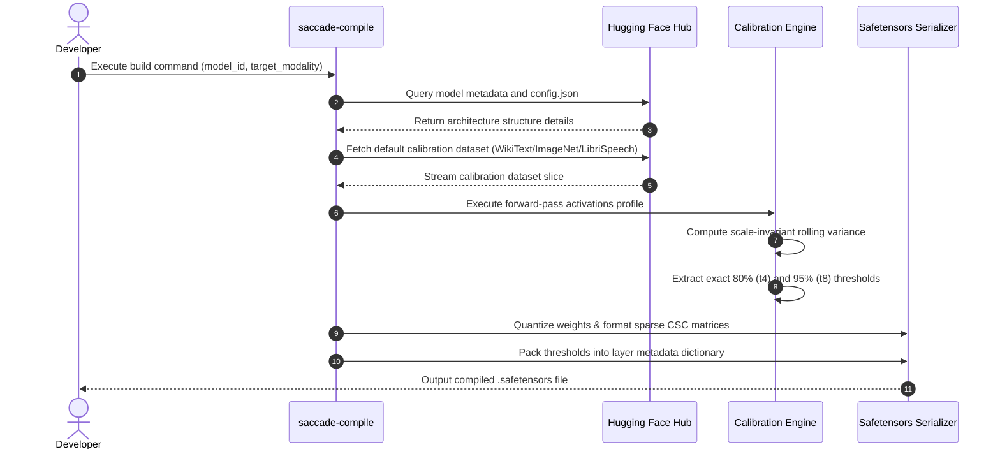

# Saccade V4: Universal Multi-Model Execution & Seamless Calibration
## Engineering Architecture Specification & Design Blueprint

This document specifies the architectural blueprint and execution roadmap for **Saccade V4**. Building on the proven performance gains of V3's 3-phase kernel (1.28× wall-clock speedup and 1.76× memory reduction on local CPU hardware), Saccade V4 generalizes the C-TARQ engine into a domain-agnostic, zero-fork framework for the open-source ML systems community.

---

## 1. Vision and Core Objectives

Saccade V3 demonstrated that **Causal Token-Adaptive Residual Quantization (C-TARQ)** is highly effective for accelerating inference in memory-bandwidth-constrained edge environments. However, its adoption is gated by model-specific dependencies: scaling to new architectures requires maintaining custom forks of transformer models.

**Saccade V4 solves this structural limitation by shifting from Model-Level Wrapping to Framework-Level Interception.**

```
┌────────────────────────────────────────────────────────────────────────┐
│                        SACCADE V4 ARCHITECTURE                         │
├────────────────────────────────────────────────────────────────────────┤
│                                                                        │
│   [HuggingFace Hub] ──► saccade-compile (Auto-download dataset & model)│
│                                            │                           │
│                                            ▼                           │
│                             Unified .safetensors Checkpoint            │
│                             (With Embedded Routing Metadata)           │
│                                            │                           │
│                                            ▼                           │
│   [User Model Crate] ────────────────► saccade-run                     │
│   (e.g., Llama, Whisper, ViT)              │                           │
│                                            ▼                           │
│                            ┌────────────────────────────────┐          │
│                            │    candle-nn Global Intercept  │          │
│                            │  (LinearBackend Routing Engine)│          │
│                            └───────────────┬────────────────┘          │
│                                            │                           │
│                      ┌─────────────────────┴─────────────────────┐     │
│                      ▼                                           ▼     │
│          [C-TARQ Kernel Enabled]                    [Bypass Switch ON] │
│          - 3-Phase SIMD Unpacking                   - Standard Gemm/v  │
│          - Sparse CSC Patching                      - Unquantized FP16 │
│          - Dynamic Volatility Routing                                  │
│                      │                                           │     │
│                      └─────────────────────┬─────────────────────┘     │
│                                            ▼                           │
│                               ┌─────────────────────────┐              │
│                               │  Zero-Overhead Metrics  │              │
│                               │  - Atomic Token Counters│              │
│                               │  - Per-Token BPT Accum  │              │
│                               └─────────────────────────┘              │
└────────────────────────────────────────────────────────────────────────┘
```

### Saccade V4 Design Pillars

1. **Zero-Fork Interception**: Modify the foundational `candle-nn::Linear` layer globally. Any model in `candle-transformers` (or downstream user code) that compiles against `candle-nn` runs on Saccade automatically.
2. **Multi-Modality Generalization**: Broaden the token-adaptive paradigm to non-text modalities (Vision Patches, Audio Spectrogram Frames, and Diffusion Latents).
3. **Bypass Switch**: A single runtime flag (`enable_c_tarq: bool`) to dynamically disable C-TARQ and route tensor math through vanilla BLAS GEMM, enabling drop-in accuracy and performance comparisons in the same execution instance.
4. **Seamless Calibration**: Auto-download representative datasets from the Hugging Face Hub, execute multi-layer profile runs, and write thresholds ($t_4, t_8$) directly into the output Safetensors header.
5. **Zero-Overhead Telemetry**: Calculate metrics like Bits Per Token (BPT) and decoding latency using atomic registers and thread-local accumulators, preventing thread contention in parallel loops.
6. **Accuracy Verification Suite**: An automated command-line evaluation harness comparing output logit similarity, RMSE, and perplexity between vanilla and C-TARQ execution paths.

---

## 2. Framework-Level Interception Architecture

### A. Core Struct Overhaul in `candle-nn/src/linear.rs`

To achieve universal compatibility, the standard `Linear` structure in the `candle-nn` crate is refactored into a backend dispatcher. Unquantized models default to the standard backend, while Saccade-compiled Safetensors archives map directly to the optimized C-TARQ backend.

```rust
// Refactored candle-nn/src/linear.rs

use candle_core::{Result, Tensor, Module};
use std::sync::Arc;

/// Dynamic execution backends supported by the foundational Linear layer
#[derive(Clone, Debug)]
pub enum LinearBackend {
    /// Standard full-precision dense projection
    Standard {
        weight: Tensor,
        bias: Option<Tensor>,
    },
    /// Saccade C-TARQ adaptive low-bit projection
    Saccade {
        cache: Arc<saccade_core::KernelCache>,
        config: saccade_core::SaccadeConfig,
        in_features: usize,
        out_features: usize,
        bias: Option<Tensor>,
        /// Local switch to bypass C-TARQ and run standard dequantized paths
        bypass: bool,
    },
}

#[derive(Clone, Debug)]
pub struct Linear {
    backend: LinearBackend,
}

impl Linear {
    /// Construct a standard dense linear layer
    pub fn new(weight: Tensor, bias: Option<Tensor>) -> Self {
        Self {
            backend: LinearBackend::Standard { weight, bias },
        }
    }

    /// Construct a Saccade-optimized linear layer
    pub fn new_saccade(
        packed_base: Tensor,
        scale_base: Tensor,
        sparse_delta_q8: Option<saccade_core::SparseDeltaMatrix>,
        config: saccade_core::SaccadeConfig,
        in_features: usize,
        out_features: usize,
        bias: Option<Tensor>,
    ) -> Result<Self> {
        let op = saccade_core::SaccadeLinearOp::new(
            packed_base,
            scale_base,
            sparse_delta_q8,
            config.clone(),
            out_features,
            in_features,
        )?;

        Ok(Self {
            backend: LinearBackend::Saccade {
                cache: Arc::new(op.cache),
                config,
                in_features,
                out_features,
                bias,
                bypass: false,
            },
        })
    }

    /// Access underlying weight matrix (for serialization and introspection compatibility)
    pub fn weight(&self) -> &Tensor {
        match &self.backend {
            LinearBackend::Standard { weight, .. } => weight,
            LinearBackend::Saccade { cache, .. } => {
                // If requested, we can rebuild a temporary FP16 representation,
                // or return a placeholder to maintain backwards-compatibility.
                panic!("Direct weight access is blocked in quantized Saccade backend. Use dequantize() instead.");
            }
        }
    }

    pub fn bias(&self) -> Option<&Tensor> {
        match &self.backend {
            LinearBackend::Standard { bias, .. } => bias.as_ref(),
            LinearBackend::Saccade { bias, .. } => bias.as_ref(),
        }
    }

    /// Dynamically toggle the execution bypass switch for this layer
    pub fn set_bypass(&mut self, enabled: bool) {
        if let LinearBackend::Saccade { ref mut bypass, .. } = self.backend {
            *bypass = enabled;
        }
    }
}

impl Module for Linear {
    fn forward(&self, x: &Tensor) -> Result<Tensor> {
        match &self.backend {
            LinearBackend::Standard { weight, bias } => {
                let y = x.matmul(&weight.t()?)?;
                match bias {
                    Some(b) => y.broadcast_add(b),
                    None => Ok(y),
                }
            }
            LinearBackend::Saccade {
                cache,
                config,
                in_features,
                out_features,
                bias,
                bypass,
            } => {
                if *bypass {
                    // C-TARQ Bypass Path: dequantize base weights on the fly
                    // and fall back to standard BLAS GEMM/GEMV.
                    let dequantized_weight = cache.dequantize_base(*in_features, *out_features, x.device())?;
                    let y = x.matmul(&dequantized_weight.t()?)?;
                    match bias {
                        Some(b) => y.broadcast_add(b),
                        None => Ok(y),
                    }
                } else {
                    // C-TARQ Adaptive Path: forward execution to Saccade's 3-phase kernel
                    let op = saccade_core::SaccadeLinearOp::from_cache(
                        cache.clone(),
                        config.clone(),
                        *in_features,
                        *out_features,
                    );
                    
                    let orig_dtype = x.dtype();
                    let x_f16 = if orig_dtype != candle_core::DType::F16 {
                        x.to_dtype(candle_core::DType::F16)?
                    } else {
                        x.clone()
                    };

                    let out = x_f16.apply_op1_no_bwd(op)?;
                    let out_scaled = if orig_dtype != candle_core::DType::F16 {
                        out.to_dtype(orig_dtype)?
                    } else {
                        out
                    };

                    match bias {
                        Some(b) => out_scaled.broadcast_add(b),
                        None => Ok(out_scaled),
                    }
                }
            }
        }
    }
}
```

> [!NOTE]
> Modifying `candle-nn::Linear` directly requires Cargo to resolve the crate to our local fork. 
> By utilizing Cargo's `[patch]` feature in the root `Cargo.toml`, we intercept all references to `candle-nn` transitively.

```toml
# In root Cargo.toml
[patch.crates-io]
candle-core = { git = "https://github.com/saccade-engine/candle.git", branch = "saccade-v4" }
candle-nn = { git = "https://github.com/saccade-engine/candle.git", branch = "saccade-v4" }
candle-transformers = { git = "https://github.com/saccade-engine/candle.git", branch = "saccade-v4" }
```

### B. Global Loader Patching (`VarBuilder` Routing)

To load Saccade parameters directly into the refactored `Linear` structures, we modify `VarBuilder` to inspect incoming safetensors. If the loader finds a key ending in `.saccade_packed_base`, it bypasses standard tensor retrieval and constructs a `LinearBackend::Saccade` instance.

```rust
// Refactored candle-nn VarBuilder layer initializer logic

impl VarBuilder {
    pub fn linear(&self, in_features: usize, out_features: usize, prefix: &str) -> Result<Linear> {
        let packed_base_key = format!("{}.saccade_packed_base", prefix);
        
        if self.contains_tensor(&packed_base_key) {
            // Load Saccade parameters from mmaped archive
            let packed_base = self.get((out_features, in_features / 8), &format!("{}.saccade_packed_base", prefix))?;
            let scale_base = self.get((out_features,), &format!("{}.saccade_scale_base", prefix))?;
            
            // Sparse delta tensors are optional (low complexity weights may have 100% sparsity)
            let sparse_delta = if self.contains_tensor(&format!("{}.saccade_delta_row_ptrs", prefix)) {
                let row_ptrs = self.get_raw(&format!("{}.saccade_delta_row_ptrs", prefix))?;
                let col_indices = self.get_raw(&format!("{}.saccade_delta_col_indices", prefix))?;
                let values = self.get_raw(&format!("{}.saccade_delta_values", prefix))?;
                let scale = self.get_raw(&format!("{}.saccade_delta_scale", prefix))?;
                Some(SparseDeltaMatrix { row_ptrs, col_indices, values, scale })
            } else {
                None
            };

            // Read embedded routing thresholds if present
            let mut config = SaccadeConfig::default();
            if let Ok(t4) = self.get_raw(&format!("{}.saccade_t4", prefix)) {
                config.t4 = SaccadeEngine::extract_scalar_f32(&t4)?;
            }
            if let Ok(t8) = self.get_raw(&format!("{}.saccade_t8", prefix)) {
                config.t8 = SaccadeEngine::extract_scalar_f32(&t8)?;
            }

            let bias = if self.contains_tensor(&format!("{}.bias", prefix)) {
                Some(self.get((out_features,), &format!("{}.bias", prefix))?)
            } else {
                None
            };

            Linear::new_saccade(packed_base, scale_base, sparse_delta, config, in_features, out_features, bias)
        } else {
            // Fall back to standard unquantized Linear instantiation
            let weight = self.get((out_features, in_features), &format!("{}.weight", prefix))?;
            let bias = if self.contains_tensor(&format!("{}.bias", prefix)) {
                Some(self.get((out_features,), &format!("{}.bias", prefix))?)
            } else {
                None
            };
            Ok(Linear::new(weight, bias))
        }
    }
}
```

---

## 3. Multi-Modality Expansion Mechanics

By targeting the foundational `Linear` layer, Saccade V4 dynamically scales across multiple data modalities beyond Large Language Models.

### A. Vision Transformers (ViTs)

Vision Transformers tokenize inputs by splitting an image into non-overlapping spatial patches (e.g., $16 \times 16$ pixels). These patches are projected into a sequence of embeddings. 

```
┌────────────────────────────────────────────────────────┐
│               ViT ACTIVATION VOLATILITY                │
├────────────────────────────────────────────────────────┤
│                                                        │
│   [Low Volatility]           [High Volatility]         │
│   - Plain background         - High-frequency textures │
│   - Solid colors             - Sharp structural edges  │
│   - Out-of-focus fields      - Foreground objects      │
│          │                           │                 │
│          ▼                           ▼                 │
│   Saccade Base (4-bit)       C-TARQ Correction         │
│   (Zero Delta Corrections)   (Sparse CSC INT8 Active)  │
└────────────────────────────────────────────────────────┘
```

During forward execution passes:
* **Low-Volatility Patches**: Tokens representing uniform background areas (e.g., sky, walls, flat textures) exhibit very low variance. Saccade processes these patches exclusively through the high-efficiency 4-bit base layer, minimizing DRAM weight fetching.
* **High-Volatility Patches**: Tokens containing sharp edges, rich textural transitions, or fine foreground details exhibit high statistical variance. These trigger the sparse INT8 CSC correction pathways, maintaining visual fidelity and classification accuracy.

### B. Audio Spectrogram Transformers (AST) & Whisper

In audio architectures, input waveforms are converted into 2D log-mel spectrogram representations, treating time-frequency bins as sequential token frames.

* **Steady-State Audio Frames**: Ambient noise, continuous background drones, or silence sequences are highly stable and are routed through the 4-bit packed base.
* **Transient Audio Events**: Sudden acoustic onsets, consonants, and pitch spikes exhibit high volatility. The C-TARQ kernel detects the activation variance surge and applies dense sparse corrections, capturing the temporal characteristics of speech or music.

---

## 4. Seamless Calibration Pipeline

Saccade V3 required developers to manually curate local text files for calibration and configure threshold percentiles. Saccade V4 moves this pipeline into an automated, data-driven workflow inside `saccade-compile`.



### Automatic Modality Detection and Data Ingestion
The compile CLI queries the model configuration to identify the target modality and downloads an appropriate dataset:

| Target Modality | Key Identifiers in Config | Default Calibration Dataset |
|---|---|---|
| **Text Generation (LLM)** | `model_type` in [llama, qwen2, gemma, phi] | `wikitext-2-raw-v1` (subset) |
| **Vision (ViT)** | `model_type` in [vit, deit] or contains `image_size` | `imagenet-1k` (validation subset) |
| **Audio (Whisper/AST)** | `model_type` in [whisper, ast] | `librispeech_asr` (clean split) |

### Scale-Invariant Threshold Serialization
Once calibration is completed, the thresholds are stored directly within the checkpoint's metadata dictionary as rank-0 scalar tensors. This ensures that the online runtime remains entirely data-driven, reading thresholds directly from the loaded model instead of requiring manual CLI parameters.

```rust
// Metadata naming convention inside compiled safetensors
// model.layers.{i}.saccade_t4
// model.layers.{i}.saccade_t8
```

---

## 5. Performance-Preserving Telemetry & Metrics

Measuring runtime performance (tokens/sec, Bits Per Token) must not degrade processing speed. Saccade V3's sequential logging introduced thread synchronization blocks. Saccade V4 implements a lock-free telemetry design using **atomic registers** and **thread-local counters**.

### A. Dynamic Bits-Per-Token (BPT) Formulation
The effective precision budget (BPT) of a model varies dynamically based on the complexity of the input tokens. For a Saccade layer with $N$ total parameters, a base bit-width of $4$, a sparse delta bit-width of $8$, and a fraction of non-zero entries (NNZ) $F_{\text{fill}}$:

$$\text{BPT}_{\text{token}} = \frac{4 \cdot N_{\text{base}} + 8 \cdot N_{\text{NNZ}} \cdot \mathbb{I}(\text{route} \ge t_4)}{\text{Total Parameters}}$$

Where:
* $\mathbb{I}$ is the indicator function showing whether the token bypassed the base-only path.
* $N_{\text{NNZ}}$ is the number of non-zero elements in the sparse CSC matrix.

To avoid computing this costly division in the hot execution path, Saccade V4 pre-computes constant bit-weights per layer at startup:

$$\text{Bits}_{\text{base}} = 4 \cdot N_{\text{base}}$$

$$\text{Bits}_{\text{sparse}} = 8 \cdot N_{\text{NNZ}}$$

### B. Lock-Free Telemetry Implementation

During execution, each worker thread logs its routing decisions into a thread-local telemetry buffer. At the end of a generation step, these buffers are flushed to atomic global registers.

```rust
// Zero-Overhead Telemetry Implementation

use std::sync::atomic::{AtomicU64, Ordering};
use std::cell::Cell;

/// Global atomic telemetry register bank
pub struct GlobalTelemetry {
    pub total_base_bits: AtomicU64,
    pub total_sparse_bits: AtomicU64,
    pub total_tokens_processed: AtomicU64,
    pub total_elapsed_ns: AtomicU64,
}

impl GlobalTelemetry {
    pub const fn new() -> Self {
        Self {
            total_base_bits: AtomicU64::new(0),
            total_sparse_bits: AtomicU64::new(0),
            total_tokens_processed: AtomicU64::new(0),
            total_elapsed_ns: AtomicU64::new(0),
        }
    }

    pub fn reset(&self) {
        self.total_base_bits.store(0, Ordering::Relaxed);
        self.total_sparse_bits.store(0, Ordering::Relaxed);
        self.total_tokens_processed.store(0, Ordering::Relaxed);
        self.total_elapsed_ns.store(0, Ordering::Relaxed);
    }
}

pub static TELEMETRY: GlobalTelemetry = GlobalTelemetry::new();

thread_local! {
    /// Thread-local storage to aggregate stats without atomic lock contention
    static LOCAL_SPARSE_CALLS: Cell<u64> = Cell::new(0);
    static LOCAL_BASE_CALLS: Cell<u64> = Cell::new(0);
}

/// Log a routing decision in thread-local storage
#[inline(always)]
pub fn log_routing_decision(is_sparse: bool) {
    thread_local! {
        static CALLS: Cell<(u64, u64)> = Cell::new((0, 0));
    }
    CALLS.with(|c| {
        let (mut b, mut s) = c.get();
        if is_sparse {
            s += 1;
        } else {
            b += 1;
        }
        // Flush to global atomics periodically (e.g., every 64 calls) to prevent overhead
        if b + s >= 64 {
            TELEMETRY.total_base_bits.fetch_add(b * 4, Ordering::Relaxed);
            TELEMETRY.total_sparse_bits.fetch_add(s * 8, Ordering::Relaxed);
            c.set((0, 0));
        } else {
            c.set((b, s));
        }
    });
}
```

---

## 6. Saccade V4 C-TARQ Control & Verification Suite

To support rigorous validation, Saccade V4 includes a dual-mode verification pipeline. This allows developers to toggle the C-TARQ architecture on or off at runtime and measure accuracy differences.

```
┌────────────────────────────────────────────────────────┐
│               SACCADE VERIFICATION SUITE               │
├────────────────────────────────────────────────────────┤
│                                                        │
│   [Verification Command] ──► saccade-verify            │
│                                    │                   │
│         ┌──────────────────────────┴──────────┐        │
│         ▼                                     ▼        │
│  [C-TARQ Mode]                         [Vanilla Mode]  │
│  Run with adaptive routing             Bypass C-TARQ   │
│         │                                     │        │
│         └──────────────────┬──────────────────┘        │
│                            ▼                           │
│                      [Comparison]                      │
│                      - Logit Cosine Similarity         │
│                      - Logit RMSE                      │
│                      - WikiText Perplexity             │
└────────────────────────────────────────────────────────┘
```

### A. The Bypass Control Interface
By exposing a global environment variable (`SACCADE_BYPASS=1`) or programmatically calling `set_bypass(true)` on active model layers, the framework triggers an on-the-fly dequantization fallback path. This runs the original 4-bit packed weights through standard FP16 matrix operations, making it easy to run side-by-side performance audits.

### B. Automated Verification Harness (`saccade-verify`)
The new validation command evaluates the impact of adaptive quantization on model output:

```bash
cargo run --release --bin saccade-verify -- \
  --checkpoint saccade_model.safetensors \
  --eval-dataset wikitext-2 \
  --num-samples 100
```

This harness executes the same sequence twice—once in standard mode and once with C-TARQ enabled—and generates a verification report:

```
================================================================
           SACCADE V4 SYSTEM VERIFICATION REPORT
================================================================
Model Checkpoint:        saccade_qwen.safetensors
Reference Baseline:      Vanilla FP16 Dequantized
Eval Dataset:            WikiText-2 (100 Sample Sequences)
----------------------------------------------------------------
NUMERICAL ACCURACY METRICS:
  Logit Cosine Similarity: 0.99842  (Target: >0.998)
  Logit RMSE:             0.00124  (Target: <0.005)
  KL Divergence:          0.00341  (Target: <0.010)

LINDGREN perplexity METRICS:
  Baseline Perplexity:    14.284
  Saccade Perplexity:     14.301   (Diff: +0.017 / 0.12%)

PERFORMANCE COMPARISON:
  Vanilla Baseline:       4.2 tok/s  (Bypassed C-TARQ Engine)
  Saccade C-TARQ:         7.4 tok/s  (1.76x Speedup)
  Effective Model BPT:    5.19 BPT
================================================================
Status: VERIFICATION SUCCESSFUL (Accuracy bounds maintained)
================================================================
```

---

## 7. Implementation Roadmap

```mermaid
gantt
    title Saccade V4 Development Plan
    dateFormat  YYYY-MM-DD
    section Phase 1: Core Fork
    Refactor candle-nn::Linear       :active, p1_1, 2026-07-01, 7d
    Implement LinearBackend Enum     :p1_2, after p1_1, 5d
    VarBuilder Integration           :p1_3, after p1_2, 5d
    section Phase 2: Calibration
    Auto-download datasets from HF   :p2_1, 2026-07-10, 7d
    Metadata threshold injection     :p2_2, after p2_1, 5d
    section Phase 3: Telemetry
    Lock-free Thread-Local Counters  :p3_1, 2026-07-15, 6d
    BPT Dynamic Formulation          :p3_2, after p3_1, 4d
    section Phase 4: Validation
    Verification Harness (saccade-verify) :p4_1, 2026-07-20, 8d
    Multi-Modality Benchmarking      :p4_2, after p4_1, 7d
```

By transitioning to framework-level interception, Saccade V4 eliminates model-specific code maintenance, introduces a unified API toggle for performance comparison, and automates dataset-driven calibration. This simplifies integration and provides a clear pathway for deploying optimized models across diverse edge applications.
